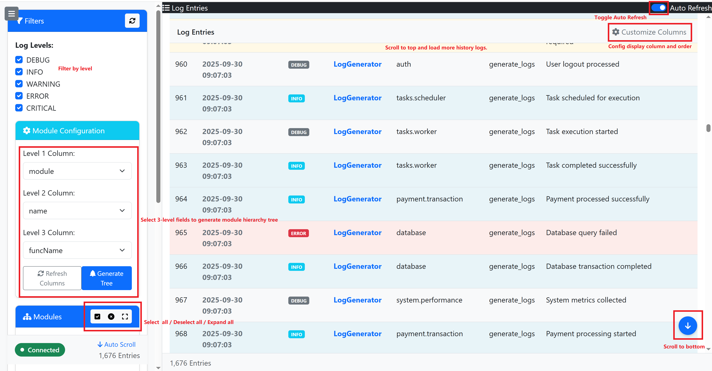
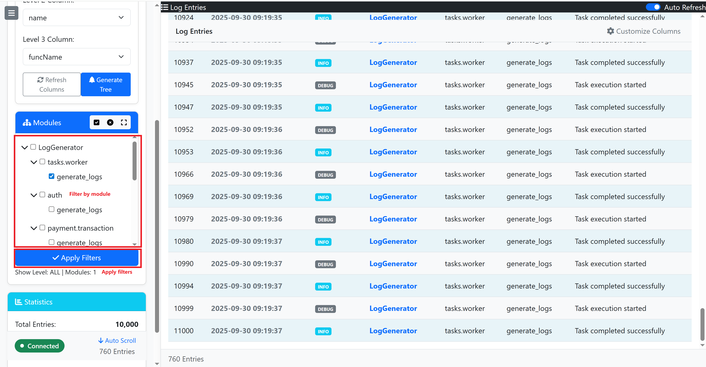
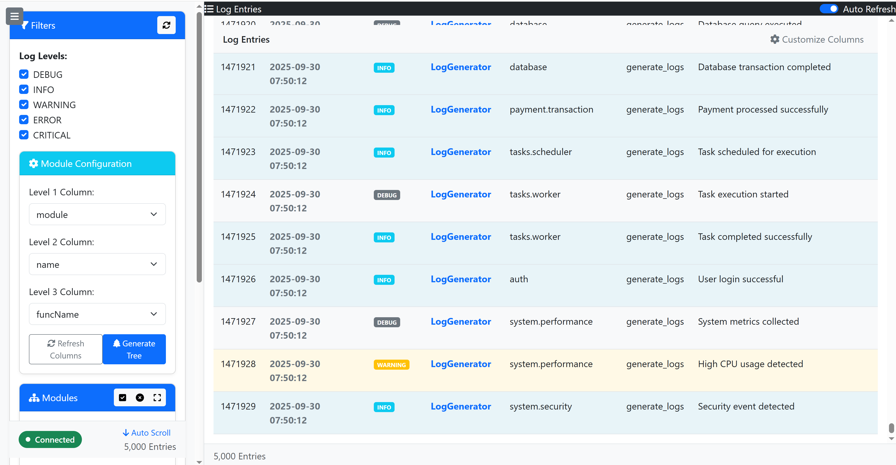

# PyLoggingBackend

## 起因

其实我最初的想法很简单，真的。只是因为 [这个项目](https://github.com/SleepySoft/IntelligenceIntegrationSystem) 需要一种分类查看Log的手段，以区分各个模块的log，从而评估运行状态。

经过向AI问询及对比，我发现其实python的logging模块----就记录功能而言----已经足够强大，不需要引入更重型的库，或者自己造轮子。但对于log的浏览方面，那花样就多了。

我希望能按 模块/文件/函数 的层次自由地过滤和浏览log，包括实时和历史log。同时，不能对程序资源占用或代码侵入过多，最好程序完全不知道有这么回事，按正常方式打log即可。

其实我能预料到，涉及到实时数据和历史数据的边界问题及动态更新问题会非常麻烦，但没想到会这么麻烦。随着想法不断调整及后续对于filter机制的更改，这个项目居然零散花费了我一周的时间。

本来只想花点时间让AI帮我搞个辅助，结果这下有点造轮子的味道了。

同时也感谢AI，因为我根本不会CSS和JS。本项目所有代码都是AI编写，我只是负责设计、审查逻辑、调试、以及调整细节罢了。

## 原理

python的logging模块可以将log输出到文件，配合jsonlogger的Formatter，可以进一步输出结构化的log。

[LogFileWrapper.py](LogFileWrapper.py) 用来监控文件变化，并维护文件缓存。其设计为缓存文件中最后10000行log，其最早的条目id为0，最新的条目id为9999。
> 
> 最初的设计里文件可无限回溯，但实现起来比较麻烦，因此最终放弃了这个设计。同理，多文件滚动更新也不支持。
> 
> 应用程序只需要将log输出到文件，后续的发布便和应用程序本身无关。因此，本工具可以配合任何文件形式的log，而不仅限于python的logging模块，即使非结构化的log也没问题。
> 

[LoggerBackend.py](LoggerBackend.py) 依赖LogFileWrapper，将文件更新内容及历史通过WebAPI发布，同时也发布作为log浏览器的前端页面。
> 
> 最初的设计中包括filter在内的大部分功能都由后端完成，后来为了效率和简化实现，后端提供全量数据，filter功能全部由前端实现。
> 

[LoggerViewer.html](LoggerViewer.html) log浏览器前端。
>
> 当前所有的filter功能都在前端实现。为了灵活，模块树的层级可配置。模块过滤逻辑为：选择上层模块即包含下层所有模块；全不选为不应用模块过滤。
> 
> 为了简化，当前前端最大支持5000条log显示，超出后新log会挤掉旧log，而并非一个显示5000条log的滑动窗口。
> 
> 
> 
> 
> 
> 稳定性及压力测试
> 
> 
> 

##

